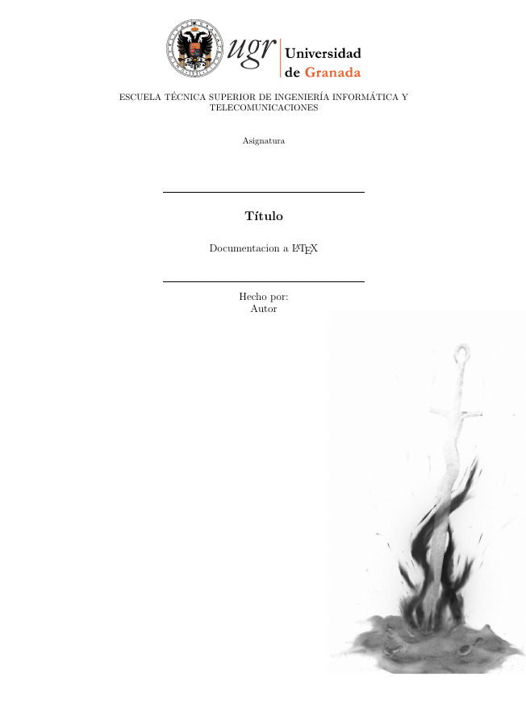
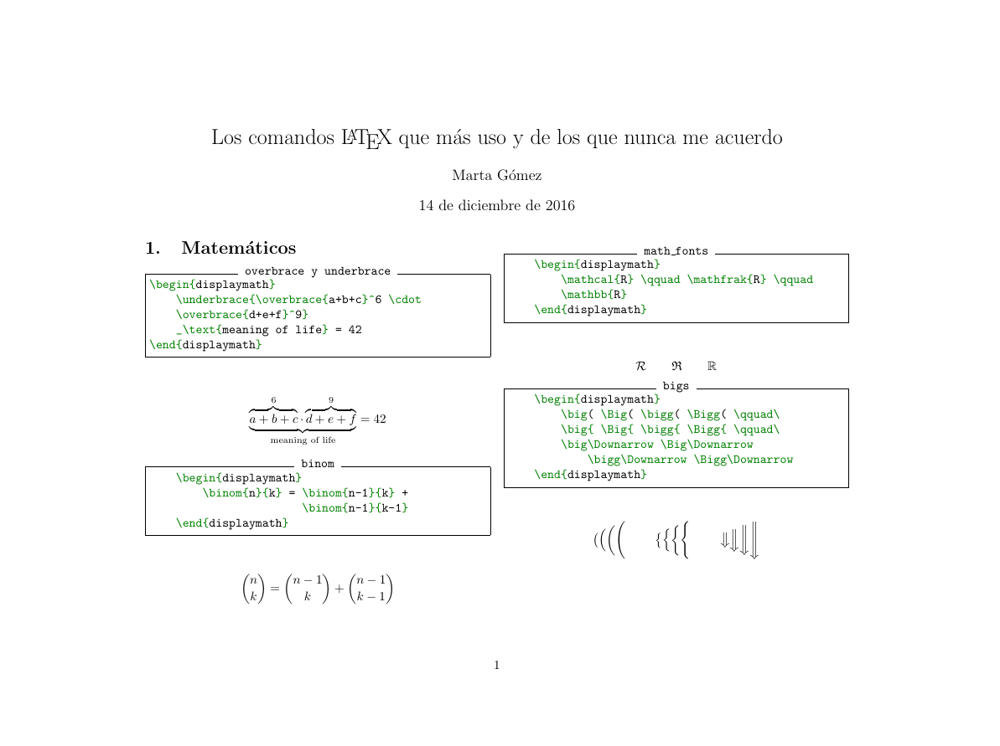

# Cabeceras-Latex

Repositorio destinado a cabeceras de latex para diversos trabajos de la carrera de Ingeniería Informática.

Todas las cabeceras tienen el paquete minted de latex así que será necesario incluirlo en nuestro sistema.

En el repositorio se encuentran unas imágenes de cabecera y background las cuales para incluirla se deberá proporcionar la ruta absoluta del archivo.

Parte del archivo básico de las cabecesras es obra de [Marta](https://github.com/mgmacias95)

Para compilar las cabeceras debes usar el siguiente comando:

`pdflatex -shell-escape <nombre del archivo>`

## Plantillas disponibles

### Cabecera Bibliografía

Documento que permite insertar bibliografía usando el comando de LaTeX `thebibliography`. Además, inserta una foto de fondo.

### Cabecera Resumen

Documento en horizontal que permite hacer resúmenes o chuletas de fórmulas para poder tener la máxima información posible en una sola página.

## Más cabeceras guays

En este [latextemplates](http://www.latextemplates.com/) podrás encontrar cabeceras de todo tipo y muy originales para tus documentos LaTeX. Destacamos la cabecera para `book` [thelegrandorangebook](http://www.latextemplates.com/template/the-legrand-orange-book) que nos permite hacer documentos coloridos y originales.
